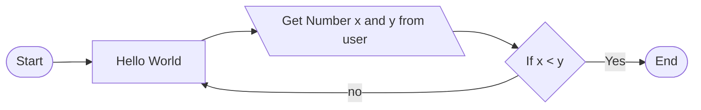

# Dag 1: Interaktive hundredetal
___Tema: Spiludvikling.___ <br>
_Et spil henvendt til børn i indskolingen_

___Muck up af spillet___
<div align="center">
  
</div>

# Læringsmål 
>* Eleverne skal kunne definere et flowchart. 
>*	Eleverne skal kunne identificere de grundlæggende symboler i et flowchart. 
>*	Eleverne skal kunne konstruere et simpelt flowchart for en given algoritme. 
>*	Eleverne skal kunne forstå sammenhængen mellem et flowchart og en programkode.


## Oplæg til Opgave 1: <br>Byg et ***flowchart*** for et interaktive hundredetal!

**Hvorfor et flowchart er vigtigt:**
> * *Overblik:* Et flowchart giver et visuelt overblik over hele programmet, fra start til slut.
> * *Planlægning:* Det hjælper med at planlægge de enkelte trin i programmet og deres rækkefølge.
> * *Fejlfinding:* Hvis der opstår problemer senere, kan flowcharten bruges til at identificere, hvor fejlen ligger.
> * *Kommunikation:* Det er en god måde at forklare andre, hvordan programmet fungerer.

### Eksempel på WorkFlow



**Sådan bygger vi et flowchart til hundredetal-spillet:** <br>
Alt efter hvilket flow vi ønsker i programmet kan vi 
*Identificer de vigtigste trin til:* 
> * Start: Programmet starter.
> * Generer tal: Et tilfældigt tal mellem 1 og 99 genereres.Vis tal: 
> * Tallet vises på skærmen.
> * Indsaml svar: Brugeren indtaster svarene.
> * Tjek svar: Svarene sammenlignes med de korrekte svar.
> * Giv feedback: Brugeren får at vide, hvor mange svar der var rigtige.
> * Nyt spil eller slut: Brugeren kan vælge at spille igen eller afslutte.  


### Tips:
* Start med at lave en simpel version af spillet, og udbyg det gradvist.
* Test din kode grundigt for at finde og rette fejl. Bruge din kollegaer.
* Spørg din instuktør eller medstuderende om hjælp, hvis du sidder fast.

# Opgave 1: 
1. Tegn et flow for programmet ved hjælp af: [___mermaid.live___](https://mermaid.live)
2. Dokumentation: [___Flowcharts - Basic Syntax___](https://mermaid.js.org/syntax/flowchart.html#data-input-output-lean-right)
3. Dokumenter dit mermaid diagram i Github's Readme repository, som du har oprettet for projektet.
4. Du skal have ___godkendt diagrammet___, før end du påbegynder programmeringsdelen!


# Opgave2: <br> Byg et interaktive hundredetal!


### Beskrivelse:
Du skal programmere et spil, hvor du skal udfylde et hundredetal. Et tal vil blive valgt tilfældigt, og brugeren/kunden/barnet skal så finde de tal, der er 10 større, 10 mindre, 1 større og 1 mindre.


<div align="center">
  
</div>

### Krav:
* **Spilmotor:** C# Winforms (Efter aftale kan specifikke spilmotor eller programmeringssprog anvendes, som f.eks: Unity, blazor eller javascript)
* **Funktionalitet:**
  * Tilfældig talgenerering
  * Brugerinput
  * Svarafstemning / feedback på om svar korrekt forkert
  * Grafisk brugerinterface


### Leverance:
* **Kode:** Indlever din kode i et git-repository på GitHub.
* **Dokumentation:** Lav en kort dokumentation, der forklarer din kode og designvalg.
* **Præsentation:** Vær klar til at præsentere dit projekt for klassen.

### Evaluering:
* **Funktionalitet:** Fungerer spillet som forventet?
* **Design:** Er spillet brugervenligt og visuelt tiltalende?
* **Kodekvalitet:** Er koden velstruktureret og let at forstå?
* **Kreativitet:** Har du tilføjet egne kreative elementer?

### Hjælpemidler:
* * **Generelt:**
  * W3Schools: https://www.w3schools.com/
  * MDN Web Docs: https://developer.mozilla.org/en-US/
  * Stack Overflow: https://stackoverflow.com/   

* **C# og .NET:**
  * Microsoft Docs: https://docs.microsoft.com/en-us/dotnet/
  * Unity Manual: https://docs.unity3d.com/Manual/index.html
* **Version kontrol:**
  * GitHub Guides: https://guides.github.com/
* **Værktøjer:**
  * Visual Studio Code: https://code.visualstudio.com/
  * GitHub Desktop: https://desktop.github.com/

### Tips:
* Start med at lave en simpel version af spillet, og udbyg det gradvist.
* Test din kode grundigt for at finde og rette fejl.
* Spørg din instuktør eller medstuderende om hjælp, hvis du sidder fast.


**Eksempel på kode (C#):**
```csharp
using System;
using System.Windows.Forms;

namespace Hundredtal
{
    public partial class Form1 : Form
    {
        private Random random = new Random();
        private int midtal;

        public Form1()
        {
            InitializeComponent();
            NyOpgave();
        }

        private void NyOpgave()
        {
            // Generer et tilfældigt tal mellem 1 og 99
            midtal = random.Next(1, 100);
            labelMidtal.Text = midtal.ToString();

            // Nulstil tekstfelter til brugerinput
            textBox10Mere.Text = "";
            textBox10Mindre.Text = "";
            textBox1Mere.Text = "";
            textBox1Mindre.Text = "";
        }

        // ... resten af koden fx event eller som herunder en knap?
        private void buttonTjekSvar_Click(object sender, EventArgs e)
        {
            // Tjek om brugerens svar er korrekte
            // ... (Implementer logikken her)
            // Vis en besked til brugeren om, hvor mange svar der var korrekte
        }
    }
}
```

# Dag 2: opsamling og forsættelse

> * Her tilføjer vi en hundredetals tabel for de elever som i indskolingen har brug for ekstra hjælp til at finde tallende.

## Opgave 3
> * Vi forsætte med inplementering og:
> * Udvidelse af programmets ___flowchart___
> * ___Flowchart skal godkendes føre du programmer___
> * Udvidelse af programkode
  
### Datagridview
> * Du skal marker det fundet tal
> * Du skal marker de tal som eleven skal udfylde

|Row 1|Row 2|Row 3 |Row 4|Row 5|Row 6|Row 7|Row 8|Row 9|Row 10|
|---|---|---|---|---|---|---|---|---|---|
|  1 |  2 |  3 |  4 |  5 |  6 |  7 |  8 |  9 | 10 |
| 11 | 12 | 13 | 14 | 15 | 16 | 17 | 18 | 19 | 20 |
| 21 | 22 | 23 | 24 | 25 | 26 | 27 | 28 | 29 | 30 |
| 31 | 32 | ___33___| 34 | 35 | 36 | 37 | 38 | 39 | 40 |
| 41 | ___42___ | __43__ | ___44___ | 45 | 46 | 47 | 48 | 49 | 50 |
| 51 | 52 | ___53___ | 54 | 55 | 56 | 57 | 58 | 59 | 60 |
| 61 | 62 | 63 | 64 | 65 | 66 | 67 | 68 | 69 | 70 |
| 71 | 72 | 73 | 74 | 75 | 76 | 77 | 78 | 79 | 80 |
| 81 | 82 | 83 | 84 | 85 | 86 | 87 | 88 | 89 | 90 |
| 91 | 92 | 93 | 94 | 95 | 96 | 97 | 98 | 99 | 100 |

### Eksemple:

<div align="center">
  
</div>

# Dag 3
* **Ekstra (valgfrit):**
  * Timer
  * Highscore
  * Forskellige sværhedsgrader
  * Tematisk design
  * Lydeffekter

# Note 
[markdownlivepreview](https://markdownlivepreview.com/)