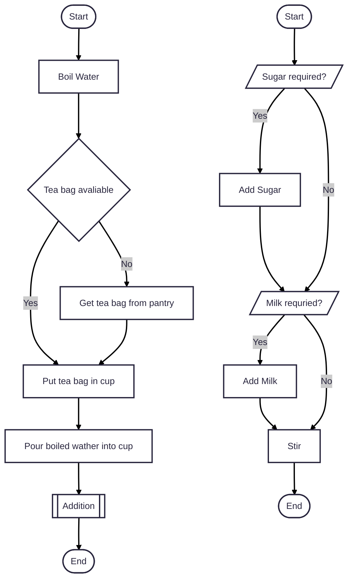

```mermaid
---
config:
  theme: redux
---
flowchart TD
    A(["Start"]) --> B["Boil Water"]
    B --> C{"Tea bag avaliable"}
    C -- Yes --> D["Put tea bag in cup"]
    C -- No --> E["Get tea bag from pantry"]
    E --> D
    D --> F["Pour boiled wather into cup"]
    F --> Add[["Addition"]]
    Add --> L(["End"])

    Start(["Start"]) --> G
    G[/"Sugar required?"/] 
    G -- Yes --> H["Add Sugar"]
    H --> I[/"Milk requried?"/]
    G -- No --> I
    I -- Yes --> J["Add Milk"]
    J --> K["Stir"]
    I -- No --> K
    K --> End(["End"])
```
